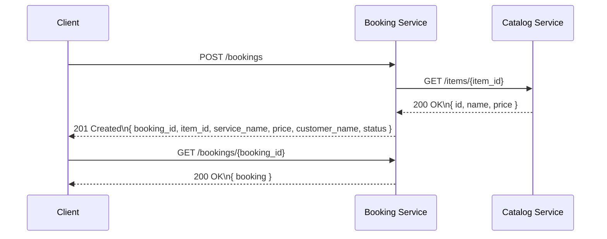

# lab-microservices

A simple microservices example with two FastAPI services:

- **Catalog Service** — provides a catalog of services/items
- **Booking Service** — creates bookings and validates items via Catalog Service

## Services

### Catalog Service
- `GET /items` — returns the full catalog
- `GET /items/{id}` — returns details for a single item

### Booking Service
- `POST /bookings` — create a booking; validates item existence and price from Catalog Service
- `GET /bookings/{id}` — get booking status

## Run locally

From the repository root:

```bash
docker compose up --build
```

Then access:

- Catalog Service: `http://localhost:8002/items`
- Booking Service: `http://localhost:9002/bookings`

## Sequence diagram

The interaction between the services is described in `sequence_diagram.puml` and `sequence_diagram.md`.

### Markdown diagram



Use PlantUML or a compatible renderer to visualize the `.puml` file:

```bash
plantuml sequence_diagram.puml
```

## Notes

- `Booking Service` depends on `Catalog Service` and queries it for item validation and current pricing
- If the item does not exist, booking creation returns `400 Bad Request`

