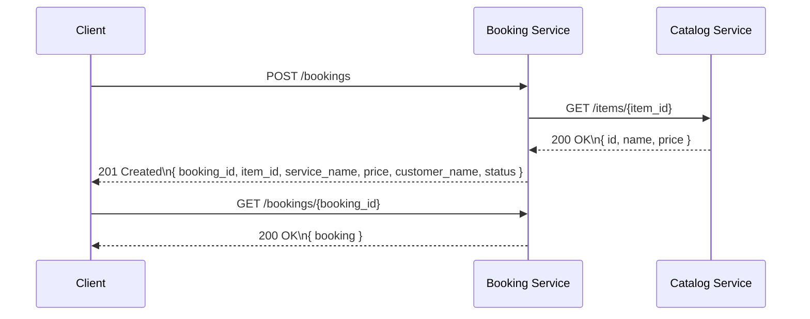

# Sequence diagram

```mermaid
sequenceDiagram
    participant Client
    participant Booking as Booking Service
    participant Catalog as Catalog Service

    Client->>Booking: POST /bookings
    Booking->>Catalog: GET /items/{item_id}
    Catalog-->>Booking: 200 OK\n{ id, name, price }
    Booking-->>Client: 201 Created\n{ booking_id, item_id, service_name, price, customer_name, status }

    Client->>Booking: GET /bookings/{booking_id}
    Booking-->>Client: 200 OK\n{ booking }
```
